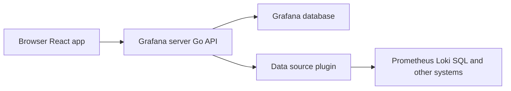

# Working on frontend features

Use this page when you are scoping a new Grafana screen. It covers the frontend decisions that change the size of the work, and enough of the backend to talk about dependencies with the people who own it.

Grafana draws metrics, logs, traces, and profiles that live in other systems. The screen is the product, and it depends on permissions, the data source, and whether the API already exists.

## How a screen gets its data

The browser runs a React application. That application calls a Grafana server written in Go. The server does two different jobs:

- It stores Grafana's own objects in Grafana's database: dashboards, users, folders, alert rules, and permissions. Local development uses SQLite. Production installs usually use PostgreSQL or MySQL.
- It asks an external system for the customer's data through a data source plugin. Grafana does not keep a copy of those metrics, logs, traces, or profiles.

A slow panel is usually the data source or the query. A blank page is usually Grafana's own API, a missing permission, or a feature toggle that is off.

## Where frontend code lives

Feature screens live under `public/app/features/`. Dashboards, Explore, and Alerting are separate areas that share a shell.

| Path | What it is |
| --- | --- |
| `public/app/features/` | Product areas such as `dashboard`, `dashboard-scene`, `explore`, and `alerting` |
| `public/app/core/` | Shared app services, navigation, and components |
| `public/app/plugins/` | Built-in plugins |
| `packages/grafana-ui` | Shared buttons, inputs, layout, and other visual components |
| `packages/grafana-data` | Data shapes and time helpers |
| `packages/grafana-runtime` | Runtime services: config, `backendSrv`, `locationService` |
| `packages/grafana-schema` | Generated types for dashboard and panel models |
| `@grafana/scenes` | Framework for dashboard-like pages. It is a dependency, not a folder in `packages/` |

New dashboard-like pages belong in the Scenes system. `public/app/features/dashboard-scene/` is the in-repo home for that work. Older dashboards still use the previous panel model.

## Decisions that change a frontend feature

**Design system.** New screens use components from `packages/grafana-ui`. Custom controls that duplicate Button, Input, Stack, or Box get rejected in review. Styling uses Emotion through `useStyles2`. Refer to [the styling guide](/contribute/style-guides/styling.md).

**Data loading.** New screens load server data with RTK Query, which requests data, caches it, and exposes loading and error states. Older screens still keep data in Redux. Refer to [the Redux guide](/contribute/style-guides/redux.md). Specs need empty, loading, and error states. Cached data can be a few seconds behind a live system.

**Feature toggles.** A feature toggle is a switch defined in `pkg/services/featuremgmt/` and exposed to the UI as `config.featureToggles` from `@grafana/runtime`. The UI has to read the toggle. Changing the config file alone does not hide a screen. Name the toggle in the spec when the rollout should be gradual.

**Permissions.** Grafana checks access with role-based access control. The UI hides or disables actions the signed-in user cannot perform. The server checks the same permission again. A frontend-only lock is not a security control. Specs should say what a viewer, an editor, and an admin each see.

**Data sources.** A Prometheus query and a Loki query do not support the same interactions. A feature that must work for every data source is a larger project than one aimed at a single source. Name the sources in scope for the first version.

**Separate pull requests.** Frontend and backend changes ship on different cadences. A screen that needs a new API field is two pull requests. Call that dependency out before implementation starts.

**Plugins.** Data source plugins fetch data. Panel plugins draw it. App plugins add a section of the product. Some features belong in a plugin instead of `public/app/features/`. That choice changes install, versioning, and who maintains the code.

**Constraints that show up on almost every screen.**

- Light and dark theme. Components from `grafana-ui` follow the active theme. Hard-coded colors often do not. Refer to [the themes guide](/contribute/style-guides/themes.md).
- Grafana can be hosted on a subpath such as `/grafana`. Links go through the supported helpers. A raw `href` drops the subpath.
- User-facing strings go through the internationalization pipeline. Run `make i18n-extract` after adding copy.
- Dates and times go through helpers in `@grafana/data` so they follow the user's time zone.

Tests for a new screen use React Testing Library. End-to-end coverage uses Playwright. Refer to [the testing guide](/contribute/style-guides/testing.md) and [the frontend style guide](/contribute/style-guides/frontend.md).

## The backend, in brief

The backend is one Go process. In production it also serves the built frontend. In development, `make run` starts the server and `yarn start` serves the frontend with hot reload. The server proxies to that frontend.

| Area | Role |
| --- | --- |
| `pkg/api/` | HTTP endpoints the browser calls |
| `pkg/services/` | Business rules for dashboards, alerting, auth, and other domains |
| `pkg/tsdb/` | Query backends for external databases |
| `pkg/plugins/` | Plugin loading. Plugins talk to the server over gRPC |
| `pkg/setting/` | Configuration from `conf/defaults.ini` and `conf/custom.ini` |
| `apps/` | Newer standalone apps for dashboards, folders, alerting, and related objects |

Services own the rules. API handlers should not grow business logic. Wire, in `pkg/server/`, connects services at startup. After a service constructor changes, run `make gen-go`.

Alert rules that Grafana manages are stored in Grafana and evaluated on a schedule. External systems such as Prometheus can own the rules instead. Where the rule lives changes the screen.

Newer objects use generated clients in `packages/grafana-api-clients`. A new screen should use a generated client when one exists, instead of hand-writing the request.

## Questions to answer before implementation

- Which data sources does the first version support?
- What does a viewer see, and what does an editor see?
- Does an API for this data already exist?
- Is this core Grafana, a plugin, or a Scenes page?
- Which editions get it, and is it behind a feature toggle?
- What are the empty, loading, error, and no-permission states?

The screen is the small part. Permissions, data-source limits, and a missing API are what move the schedule.

## Where to read next

- [Frontend data requests](frontend-data-requests.md) for how the browser cancels and queues HTTP calls.
- [Backend contribution guide](/contribute/backend/README.md) for services, the database, and the HTTP API.
- [Kubernetes-inspired backend architecture](k8s-inspired-backend-arch.md) for the newer app APIs.
- [Grafana fundamentals](https://grafana.com/docs/grafana/latest/fundamentals/) for the product model.
- [Feature toggles](https://grafana.com/docs/grafana/latest/setup-grafana/configure-grafana/feature-toggles/) for how operators turn a switch on.
