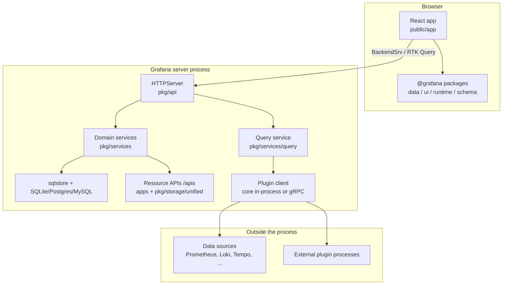
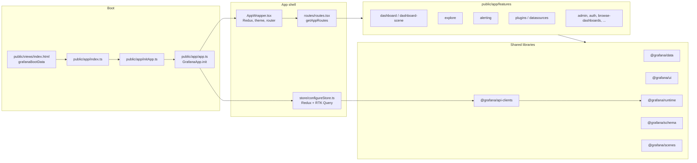
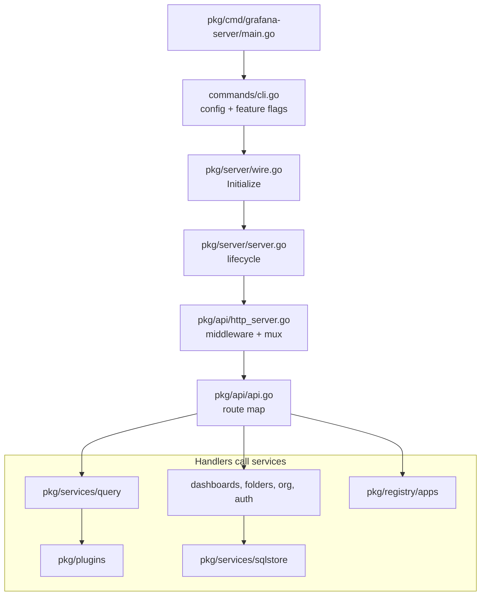
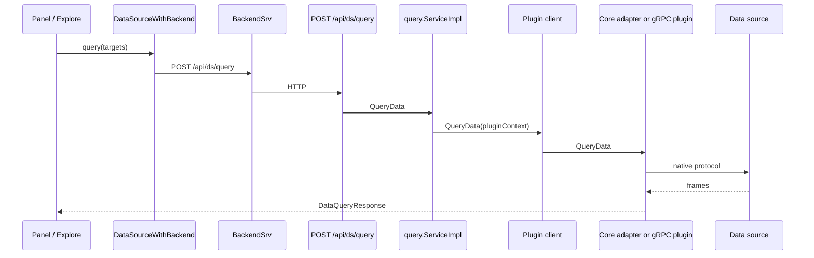

# Grafana codebase architecture

This page is a map of the Grafana monorepo. Use it to find where a change belongs and how a request moves from the browser to storage or a data source.

Grafana is one product with two deploy cadences: a Go backend and a TypeScript/React frontend. Keep frontend and backend changes in separate pull requests when you can.

## System overview

The browser loads a React app that the Grafana server serves. Feature code talks to the backend through `BackendSrv` (REST and RTK Query). The backend is a Wire-assembled process: HTTP routes in `pkg/api` call services in `pkg/services`, which persist data through `sqlstore` or the newer `/apis` resource layer, and run data-source queries through the plugin client.

## Monorepo layout

These are the directories that define the architecture. Ignore tooling and test harnesses until you need them.

| Directory | Purpose |
| --- | --- |
| `public/app/` | Grafana frontend application: routes, features, core services, built-in plugins |
| `packages/` | Shared frontend libraries published as `@grafana/*` |
| `pkg/` | Grafana backend: HTTP API, services, plugins, query backends, server bootstrap |
| `apps/` | App SDK modules that own Kubernetes-style resources under `/apis` |
| `conf/` | Runtime config. Defaults live in `conf/defaults.ini` |
| `kinds/` and `kindsv2/` | CUE schemas that generate Go and TypeScript types |
| `contribute/` | Contributor docs, including this architecture set |
| `docs/` | Published product documentation |
| `devenv/` | Optional backing services for local development |
| `e2e-playwright/` | Playwright end-to-end tests |

## Frontend architecture

The frontend is a Yarn workspace React app. Feature folders own pages and domain state. Shared UI and data types live in `packages/`. Built-in datasource and panel plugins live next to the app under `public/app/plugins/`.

### Frontend entry points

Start here when you need to trace startup or routing:

- `public/views/index.html` — HTML shell. The backend injects `window.grafanaBootData` and the JS assets.
- `public/app/index.ts` — waits for boot data, then loads the app.
- `public/app/app.ts` — registers runtime services (`setBackendSrv`, `setDataSourceSrv`), configures the Redux store, preloads plugins, and renders `AppWrapper`.
- `public/app/AppWrapper.tsx` — providers (Redux, theme, router, extensions).
- `public/app/routes/routes.tsx` — lazy-loaded route table for features.
- `public/app/store/configureStore.ts` and `public/app/core/reducers/root.ts` — Redux Toolkit store plus RTK Query reducers.

### Feature and package map

`public/app/features/` is split by product area. Common landing spots:

- **Dashboards:** `dashboard/`, `dashboard-scene/`, `browse-dashboards/`, `panel/`
- **Query and explore:** `explore/`, `query/`, `datasources/`, `variables/`, `templating/`
- **Alerting:** `alerting/` (see also `public/app/features/alerting/unified/AGENTS.md`)
- **Platform:** `plugins/`, `auth-config/`, `admin/`, `org/`, `search/`

`packages/` is the public frontend API surface. The ones you will import most often:

| Package | Role |
| --- | --- |
| `@grafana/data` | Frames, field types, time ranges, plugin contracts |
| `@grafana/ui` | Shared React components and theme primitives |
| `@grafana/runtime` | `BackendSrv`, `DataSourceWithBackend`, config, location |
| `@grafana/schema` | CUE-generated dashboard and panel types |
| `@grafana/scenes` | Dashboard scene runtime |
| `@grafana/api-clients` | Generated RTK Query clients for `/api` and `/apis` |

## Backend architecture

The server binary starts in `pkg/cmd/grafana-server`, Wire-builds the process in `pkg/server/wire.go`, and serves HTTP from `pkg/api.HTTPServer`. Handlers stay thin. Business logic lives in `pkg/services/<domain>`.

### Backend request path

A typical `/api` request walks this stack:

1. **Listener and middleware** in `pkg/api/http_server.go` — tracing, metrics, gzip, recovery, CSRF, auth context, CSP.
2. **Route map** in `pkg/api/api.go` — app pages (`/`, `/d/:uid`, `/explore`) and JSON APIs under `/api/...`.
3. **Domain service** in `pkg/services/*` — injected into `HTTPServer`. Services register with Wire through a `ProvideService` constructor.
4. **Persistence** — most legacy state goes through `sqlstore` (`db.DB`). Resource APIs persist through unified storage (`pkg/storage/unified`) and App SDK apps under `apps/`.
5. **Queries** — `POST /api/ds/query` lands in `pkg/api/ds_query.go`, then `pkg/services/query`, then the plugin client.

Two HTTP surfaces coexist:

- **`/api/...`** — legacy Grafana HTTP API. Still the default for much of the UI.
- **`/apis/<group>/<version>/...`** — Kubernetes-inspired resource APIs. New apps land here. The migration plan is in [k8s-inspired-backend-arch.md](k8s-inspired-backend-arch.md).

### App SDK apps

`apps/` modules own a resource type. A typical app has a CUE manifest (`apps/<name>/kinds/manifest.cue`), a Go app (`apps/<name>/pkg/app/app.go`), and an installer under `pkg/registry/apps`. Examples: `dashboard`, `folder`, `playlist`, `alerting`, `provisioning`.

## Query and plugin path

Data-source queries are plugin calls. Core datasources run in-process. External plugins run as separate gRPC processes.

Plugin discovery splits sources:

- **Core:** `public/app/plugins/datasource` and `public/app/plugins/panel`, plus in-process Go adapters in `pkg/services/pluginsintegration/coreplugin`.
- **External:** configured plugin directories. Backend communication uses HashiCorp go-plugin over gRPC (`pkg/plugins/backendplugin/grpcplugin`).

The loader pipeline is discovery → bootstrap → validation → initialization → registry (`pkg/plugins/manager/loader`).

## How the frontend talks to the backend

Three client patterns show up everywhere:

- **`BackendSrv`** (`public/app/core/services/backend_srv.ts`, contract in `@grafana/runtime`) — Fetch wrapper with retries, cancellation, org headers, and streaming. Most ad-hoc REST calls go through it. Request-queue behavior is documented in [frontend-data-requests.md](frontend-data-requests.md).
- **RTK Query** (`@grafana/api-clients`) — `createBaseQuery` calls `getBackendSrv().fetch()`. Legacy clients use `/api`. Resource clients use `/apis/<group>/<version>/...`.
- **`DataSourceWithBackend`** (`packages/grafana-runtime/src/utils/DataSourceWithBackend.ts`) — datasource plugins post queries to `/api/ds/query` (or the feature-flagged `/apis/query.grafana.app/.../query`) and hit `/api/datasources/uid/:uid/resources/...` for plugin resources.

The backend can also proxy HTTP to a datasource (`/api/datasources/proxy/...` → `pkg/services/datasourceproxy`).

## Architectural decisions that affect everyday work

- **Wire DI.** Adding a backend service means a `ProvideService` constructor and a registration in `pkg/server/wire.go`. Run `make gen-go` after you change providers. Circular dependencies fail at generate time, not at runtime.
- **Feature toggles.** Flags live in `pkg/services/featuremgmt/`. Run `make gen-feature-toggles` after edits. Both frontend routes and backend app installers branch on flags.
- **CUE schemas.** Dashboard and panel shapes in `kinds/` generate Go and TypeScript. Run `make gen-cue` after schema edits.
- **Plugin-first queries.** The query service does not speak Prometheus or Loki itself. It groups queries by datasource and delegates to the plugin client.
- **Separate frontend and backend PRs.** The two sides deploy on different cadences. A feature that needs both still lands cleaner as two reviews.

## Where to go next

- Frontend style and Redux conventions: [contribute/style-guides/frontend.md](../style-guides/frontend.md) and [contribute/style-guides/redux.md](../style-guides/redux.md)
- Backend services, HTTP API, and database: [contribute/backend/README.md](../backend/README.md)
- Local setup: [contribute/developer-guide.md](../developer-guide.md)
- Resource API migration: [k8s-inspired-backend-arch.md](k8s-inspired-backend-arch.md)
- Frontend request cancellation: [frontend-data-requests.md](frontend-data-requests.md)
